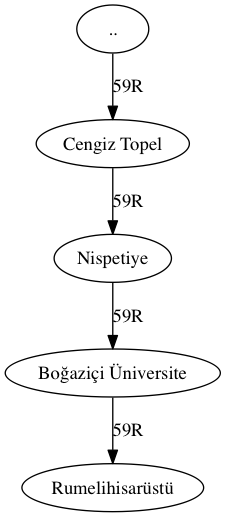

% İstanbul Toplu Taşıma Ağı Analizi
% Ahmet Emre Aladağ - Boğaziçi Ü.
% 3 Şubat 2016 - AB'16

# Giriş

## Trafik

* Trafik metropollerin en önemli sorunlarından birisi
* Trafiğin kaynağı
    * plansız şehirleşme
    * altyapı yetersizliği
    * yanlış toplu taşıma politikaları
* İstanbul: 15 milyonluk dev bir şehir  

## Çözüm Arayışı

* İstanbul'daki yapısal darboğazları ağ analizi ile tespit edebilir miyiz?
* Daha iyi tasarlanmış otobüs hatları önerebilir miyiz?

## Veri Kaynağı

* Otobüs güzergahları: CitySDK API

## Veri Biçemi

* Konumsal Çizge (Spatial Graph)
* Çokluağ: iki durak arasında birden fazla hat geçebiliyor.
    * Düğüm => Duraklar
    * Düğüm yerleşimi => Durak koordinatı
    * Kenar => İki durak arası otobüs geçişi (kuş uçuşu)

## Örnek düğüm ve kenarlar

## Araçlar

* Scrapy
* R Programlama dili
* igraph
* ggmap

# Analiz

## Çoklu Çizge

## Ağırlıklı Ulaşım Ağı

## Kenar Arasındalığı

* Ağda herhangi $s$ düğümünden herhangi $t$ düğümüne giden en kısa patikaların listesi $\lambda_{st}$, sayısı $\sigma_{st}$ olsun.
* $\lambda_{st}$ içindeki en kısa patikalardan $e = (u, v)$ kenarı üzerinden geçenlerin sayısı da $\sigma_{st}(u, v)$ olsun.

* $g(u, v)= \sum_{s \neq u \neq v \neq t}\frac{\sigma_{st}(u,v)}{\sigma_{st}}$

## Kenar Arasındalığı - Görsel

## Kenar Arasındalığı - Sonuç

* Boğaziçi Köprüsü
* FSM Köprüsü
* Haliç Köprüsü
* E-5
* Bunları birbirine bağlayan yollar
    * Haliç-Zincirlikuyu
    * Zincirlikuyu-Levent
    * Kozyatağı-Kavacık

## Düğüm Arasındalığı

* Ağda $s$ düğümünden $t$ düğümüne giden en kısa patikaların listesi $\lambda_{st}$, sayısı $\sigma_{st}$ olsun.
* $\lambda_{st}$ içindeki en kısa patikalardan $v$ üzerinden geçenlerin sayısı da $\sigma_{st}(v)$ olsun.

* $g(v)= \sum_{s \neq v \neq t}\frac{\sigma_{st}(v)}{\sigma_{st}}$

## Düğüm Arasındalığı - Görsel

## Düğüm Arasındalığı - Sonuç

* Mecburi geçiş noktaları
    * Sabiha Gökçen Havalimanı
    * Kavacık Köprüsü
    * Taksim
    * Eminönü İskele
    * Yenikapı Sahil
    * Dolmabahçe
    * 4 Levent

# Sonuç

## Çıkarımlar

* Sadece otobüs güzergahlarına bakılarak darboğazlar tespit edilebiliyor.
* Otobüs rotaları, gerçek trafiği temsil edebiliyor.
* Ağ analizi, altyapının iyileştirilmesi için kullanılabilir.

## Sonraki Adımlar

* Kenar mesafelerinin (iki durak arası) en kısa yol hesabında kullanılması
* Otobüs saatlerinin hesaba katılarak simülasyon sistemleri geliştirilmesi
* Yol genişliğinin hesaba katılması
* Nüfus dağılımının akış modeli ile kullanılması

## Potansiyel Kullanımlar

* Bir kaza durumunda hangi noktaların etkileneceğinin analizi
* Yeni yapılacak yolların trafiği ne kadar rahatlatabileceğinin ölçümü
* Daha iyi hat tasarımlarının yapılması, etkilerinin ölçümü

## Teşekkürler

* Ahmet Emre Aladağ (@aladagemre)
* http://www.emrealadag.com
* https://github.com/aladagemre/istanbul-transportation-network
